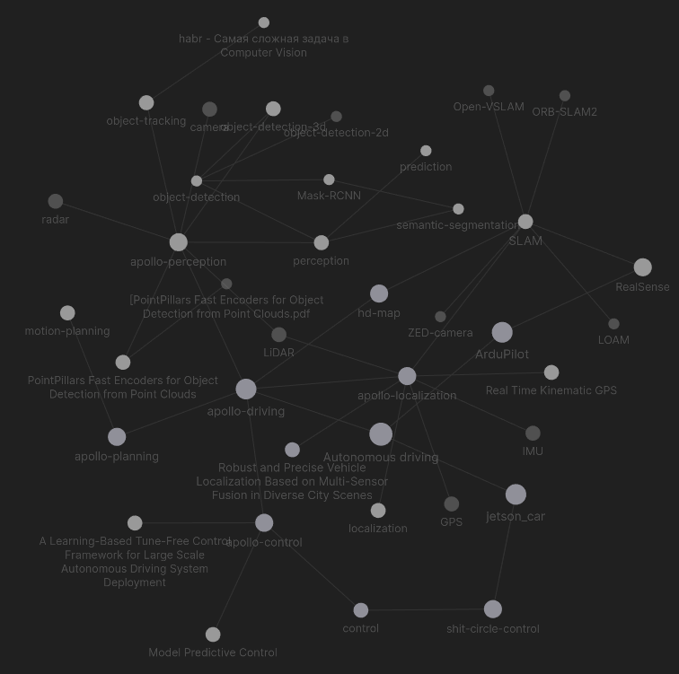

# autonomous-driving-notes
Graph-based notes (knowledge base) to learn autonomous driving

## How to use
Since PDF files are large, Git Large File Storage (Git LFS) should be used. [Learn more](https://git-lfs.github.com/). 

I recommend to use [Obsidian](https://obsidian.md/) software to visualize the relation between notes in graph form.

If you know a better software, please, let me know :)
